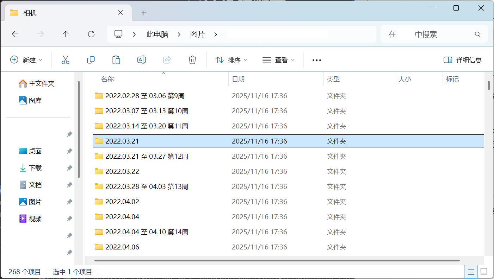

# 照片整理脚本

实际上是文件整理脚本

## 使用方法

`python -u ./photo-sort.py -i INPUT_DIR -o OUTPUT_DIR`

其中:

`INPUT_DIR` - 你想要整理的那个文件夹

`OUTPUT_DIR`C - 你的文件会被 **移动** 到OUTPUT_DIR目录下的子文件夹中

如果 当日的文件超过了代码中定义的 `THRESHOLD = 20 (by default)`，那么会认定这一天是特别的一天，单独创建文件夹，否则会和其他文件一起，按周整理.

## 效果展示

## 在此之外

expand-all.py 用于展开文件夹中的子文件夹，只考虑直接子文件夹，不会深展开
